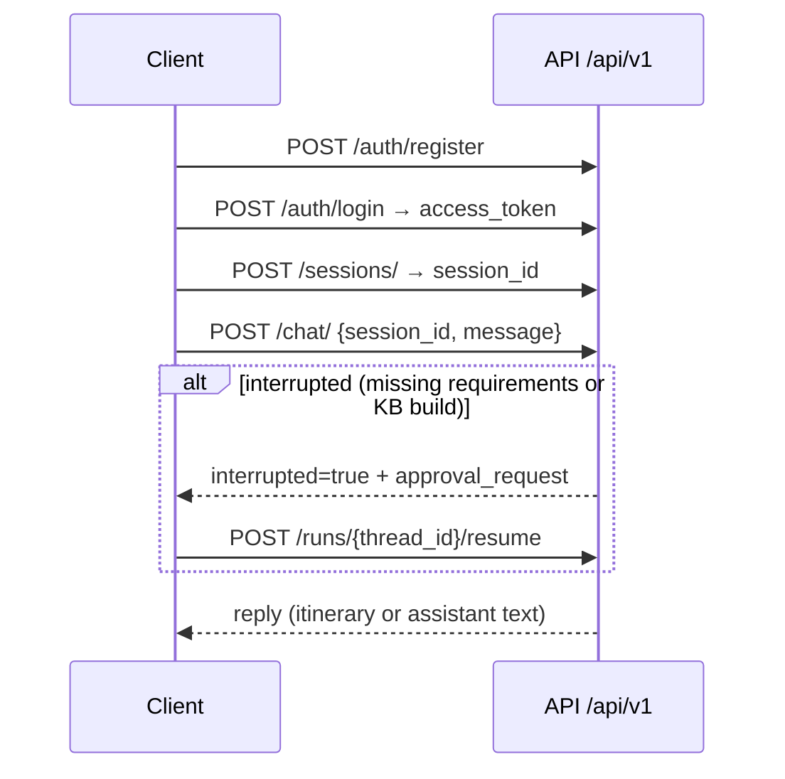

# API Reference

Comprehensive HTTP API documentation for the **Autonomous Travel Guide** service.

All application routes are prefixed with **`/api/v1`**.  
Base URL (local default): `http://localhost:8000`

| Resource | URL |
|---|---|
| Swagger UI (interactive) | <http://localhost:8000/docs> |
| ReDoc | <http://localhost:8000/redoc> |
| OpenAPI JSON | <http://localhost:8000/openapi.json> |
| This document | Canonical written reference (kept in sync with routers under `app/api/v1/`) |

---

## Table of contents

1. [Overview](#1-overview)
2. [Authentication](#2-authentication)
3. [Common conventions](#3-common-conventions)
4. [Typical client workflow](#4-typical-client-workflow)
5. [Endpoints at a glance](#5-endpoints-at-a-glance)
6. [Health](#6-health)
7. [Authentication endpoints](#7-authentication-endpoints)
8. [Users](#8-users)
9. [Sessions](#9-sessions)
10. [Chat](#10-chat)
11. [Human approval (runs)](#11-human-approval-runs)
12. [SSE streaming protocol](#12-sse-streaming-protocol)
13. [Errors](#13-errors)
14. [Schema reference](#14-schema-reference)
15. [Out of scope](#15-out-of-scope)

---

## 1. Overview

| Item | Value |
|---|---|
| Framework | FastAPI |
| Version prefix | `/api/v1` (only version currently served) |
| Content type | `application/json` (except SSE: `text/event-stream`) |
| IDs | UUIDv7 for users and sessions |
| Auth | JWT Bearer (`Authorization: Bearer <access_token>`) |
| CORS | Permissive (`*` origins) in the default app factory |

**Public endpoints** (no Bearer token):

- `GET /api/v1/health`
- `POST /api/v1/auth/register`
- `POST /api/v1/auth/login`
- `POST /api/v1/auth/refresh`

**Protected endpoints:** everything else, including `GET /api/v1/auth/me`.

Total routes served by this app: **18**.

---

## 2. Authentication

### 2.1 Scheme

```http
Authorization: Bearer <access_token>
```

In Swagger UI, click **Authorize** and paste **only** the access token (Swagger adds the `Bearer` prefix).

### 2.2 Token lifecycle

| Token | Purpose | Default TTL | Setting |
|---|---|---|---|
| Access | Authorize protected routes | 30 minutes | `ACCESS_TOKEN_EXPIRE_MINUTES` |
| Refresh | Rotate into a new access + refresh pair | 7 days | `REFRESH_TOKEN_EXPIRE_DAYS` |

- Algorithm: HS256 (`JWT_ALGORITHM`, secret from `JWT_SECRET_KEY`).
- Claims include `sub` (user id), `iat`, `exp`, and `type` (`access` | `refresh`).
- Passwords are hashed with bcrypt (SHA-256 prehash) before storage.
- There is **no API-key auth** on this service’s HTTP surface.

### 2.3 Ownership rules

| Resource | Rule |
|---|---|
| Users | Path `user_id` must equal the authenticated user → else `403 FORBIDDEN` |
| Sessions | Non-owners receive `404 NOT_FOUND` (existence is not leaked) |
| Chat / runs | Require a valid Bearer token; `thread_id` is the session id |

---

## 3. Common conventions

### 3.1 Headers

| Header | Direction | Meaning |
|---|---|---|
| `Authorization` | request | `Bearer <access_token>` on protected routes |
| `Content-Type` | request | `application/json` for bodies |
| `x-request-id` | request (optional) | Client correlation id; echoed on the response |
| `x-request-id` | response | Always present (generated if the client omitted one) |
| `x-process-time-ms` | response | Server wall-clock time for the request |

### 3.2 Success responses

- `200` — OK with a JSON body
- `201` — Created (`register`, `create session`)
- `204` — No content (`delete user`, `delete session`)

### 3.3 Error envelope

All domain/`AppException` failures use:

```json
{
  "error": {
    "code": "NOT_FOUND",
    "detail": "Session '…' not found."
  }
}
```

FastAPI / Pydantic validation failures use the framework’s standard `422` body (`detail` as a list of field errors), not this envelope.

See [Errors](#13-errors) for the full code → HTTP map.

---

## 4. Typical client workflow



1. Register (or login).
2. Create a session → `session_id` (also the LangGraph `thread_id`).
3. Call `POST /chat/` or `POST /chat/stream`.
4. If `interrupted: true`, resume via `POST /runs/{thread_id}/resume`.
5. Optionally poll `GET /runs/{thread_id}/state`.
6. Reload a conversation UI with `GET /sessions/{session_id}/messages`.

---

## 5. Endpoints at a glance

| Method | Path | Tag | Auth |
|---|---|---|---|
| `GET` | `/health` | Health | no |
| `POST` | `/auth/register` | Authentication | no |
| `POST` | `/auth/login` | Authentication | no |
| `POST` | `/auth/refresh` | Authentication | no |
| `GET` | `/auth/me` | Authentication | **yes** |
| `GET` | `/users/` | Users | yes |
| `GET` | `/users/{user_id}` | Users | yes (self-only) |
| `PATCH` | `/users/{user_id}` | Users | yes (self-only) |
| `DELETE` | `/users/{user_id}` | Users | yes (self-only) |
| `POST` | `/sessions/` | Sessions | yes |
| `GET` | `/sessions/` | Sessions | yes |
| `GET` | `/sessions/{session_id}` | Sessions | yes (owner) |
| `GET` | `/sessions/{session_id}/messages` | Sessions | yes (owner) |
| `PATCH` | `/sessions/{session_id}` | Sessions | yes (owner) |
| `DELETE` | `/sessions/{session_id}` | Sessions | yes (owner) |
| `POST` | `/chat/` | Chat | yes |
| `POST` | `/chat/stream` | Chat | yes |
| `POST` | `/runs/{thread_id}/resume` | Human Approval | yes |
| `GET` | `/runs/{thread_id}/state` | Human Approval | yes |

Paths below are shown **relative to `/api/v1`**. Full URL example: `http://localhost:8000/api/v1/health`.

---

## 6. Health

### `GET /health`

Smoke check that the API process is up.

| | |
|---|---|
| Auth | None |
| Path / query | None |
| Body | None |
| Success | `200` |

**Response**

```json
{
  "status": "healthy",
  "app": "Autonomous Travel Guide System",
  "version": "0.1.0",
  "environment": "development"
}
```

| Field | Type | Description |
|---|---|---|
| `status` | string | Always `"healthy"` when reachable |
| `app` | string | `APP_NAME` from settings |
| `version` | string | `APP_VERSION` from settings |
| `environment` | string | `ENVIRONMENT` (`development`, `stage`, …) |

**curl**

```bash
curl http://localhost:8000/api/v1/health
```

---

## 7. Authentication endpoints

Router: `app/api/v1/routers/auth_router.py`  
Schemas: `user_schema.py`, `token_schema.py`

### `POST /auth/register` → `201`

Create an account.

**Request body — `UserRegisterRequest`**

| Field | Type | Constraints | Required |
|---|---|---|---|
| `name` | string | 1–120 chars | yes |
| `email` | email | unique | yes |
| `password` | string | 8–128 chars | yes |

```json
{
  "name": "Ada Lovelace",
  "email": "ada@example.com",
  "password": "StrongPass123!"
}
```

**Response — `UserResponse`**

```json
{
  "id": "019d92aa-a6f4-74d3-a353-83f65edbb83e",
  "name": "Ada Lovelace",
  "email": "ada@example.com",
  "is_active": true,
  "created_at": "2026-08-27T18:00:00Z",
  "updated_at": "2026-08-27T18:00:00Z"
}
```

| Error | Code | When |
|---|---|---|
| `409` | `ALREADY_EXISTS` | Email already registered |
| `422` | (validation) | Invalid email / short password / etc. |

**curl**

```bash
curl -X POST http://localhost:8000/api/v1/auth/register \
  -H "Content-Type: application/json" \
  -d '{"name":"Ada","email":"ada@example.com","password":"StrongPass123!"}'
```

---

### `POST /auth/login` → `200`

Authenticate and receive a JWT pair.

**Request body — `UserLoginRequest`**

| Field | Type | Required |
|---|---|---|
| `email` | email | yes |
| `password` | string | yes |

```json
{
  "email": "ada@example.com",
  "password": "StrongPass123!"
}
```

**Response — `TokenResponse`**

```json
{
  "access_token": "eyJhbGciOiJIUzI1NiIsInR5cCI6IkpXVCJ9…",
  "refresh_token": "eyJhbGciOiJIUzI1NiIsInR5cCI6IkpXVCJ9…",
  "token_type": "bearer"
}
```

| Error | Code | When |
|---|---|---|
| `401` | `INVALID_CREDENTIALS` | Wrong email or password |

**curl**

```bash
curl -X POST http://localhost:8000/api/v1/auth/login \
  -H "Content-Type: application/json" \
  -d '{"email":"ada@example.com","password":"StrongPass123!"}'
```

---

### `POST /auth/refresh` → `200`

Exchange a refresh token for a **new** access + refresh pair (rotation).

**Request body — `RefreshTokenRequest`**

| Field | Type | Required |
|---|---|---|
| `refresh_token` | string | yes |

```json
{
  "refresh_token": "eyJhbGciOiJIUzI1NiIsInR5cCI6IkpXVCJ9…"
}
```

**Response — `TokenResponse`** (same shape as login)

| Error | Code | When |
|---|---|---|
| `401` | `TOKEN_EXPIRED` | Refresh JWT past `exp` |
| `401` | `INVALID_TOKEN` | Malformed / wrong type |
| `404` | `NOT_FOUND` | User behind the token no longer exists |

**curl**

```bash
curl -X POST http://localhost:8000/api/v1/auth/refresh \
  -H "Content-Type: application/json" \
  -d '{"refresh_token":"'"$REFRESH"'"}'
```

---

### `GET /auth/me` → `200`

Profile for the authenticated user. **Requires Bearer token.**

**Response — `UserResponse`**

| Error | Code | When |
|---|---|---|
| `401` | `AUTHENTICATION_ERROR` / `TOKEN_*` | Missing or bad token |
| `404` | `NOT_FOUND` | User deleted after token issued |

**curl**

```bash
curl http://localhost:8000/api/v1/auth/me \
  -H "Authorization: Bearer $TOKEN"
```

---

## 8. Users

Router: `app/api/v1/routers/user_router.py`  
All routes require Bearer auth and **self-access** on path `user_id`.

### `GET /users/` → `200`

Returns a **list containing only the current user** (list shape kept for forward compatibility).

```json
[
  {
    "id": "019d92aa-a6f4-74d3-a353-83f65edbb83e",
    "name": "Ada Lovelace",
    "email": "ada@example.com",
    "is_active": true,
    "created_at": "2026-08-27T18:00:00Z",
    "updated_at": "2026-08-27T18:00:00Z"
  }
]
```

**curl**

```bash
curl http://localhost:8000/api/v1/users/ \
  -H "Authorization: Bearer $TOKEN"
```

---

### `GET /users/{user_id}` → `200`

Fetch one user by UUIDv7. Must be the caller’s own id.

| Path param | Type | Description |
|---|---|---|
| `user_id` | UUID | Target user |

| Error | Code | When |
|---|---|---|
| `403` | `FORBIDDEN` | `user_id` ≠ authenticated user |
| `404` | `NOT_FOUND` | User missing |

**curl**

```bash
curl http://localhost:8000/api/v1/users/$USER_ID \
  -H "Authorization: Bearer $TOKEN"
```

---

### `PATCH /users/{user_id}` → `200`

Partial update of own profile.

**Request body — `UserUpdateRequest`** (all fields optional)

| Field | Type | Constraints |
|---|---|---|
| `name` | string \| null | 1–120 |
| `email` | email \| null | must remain unique |
| `is_active` | bool \| null | — |

```json
{
  "name": "Ada L.",
  "email": "ada.new@example.com"
}
```

**Response — `UserResponse`**

| Error | Code | When |
|---|---|---|
| `403` | `FORBIDDEN` | Not self |
| `404` | `NOT_FOUND` | User missing |
| `409` | `ALREADY_EXISTS` | Email taken |
| `422` | (validation) | Bad field values |

**curl**

```bash
curl -X PATCH http://localhost:8000/api/v1/users/$USER_ID \
  -H "Authorization: Bearer $TOKEN" \
  -H "Content-Type: application/json" \
  -d '{"name":"Ada L."}'
```

---

### `DELETE /users/{user_id}` → `204`

Delete the account. Related **sessions cascade-delete**. Empty body.

| Error | Code | When |
|---|---|---|
| `403` | `FORBIDDEN` | Not self |
| `404` | `NOT_FOUND` | User missing |

**curl**

```bash
curl -X DELETE http://localhost:8000/api/v1/users/$USER_ID \
  -H "Authorization: Bearer $TOKEN"
```

---

## 9. Sessions

Router: `app/api/v1/routers/session_router.py`  
A session is the persistence handle for a LangGraph thread: **one session ↔ one `thread_id`**.

### `POST /sessions/` → `201`

Create a conversation session for the authenticated user.

**Request body — `SessionCreateRequest`**

| Field | Type | Constraints | Default |
|---|---|---|---|
| `title` | string | max 255 | `"New Chat"` |

```json
{
  "title": "Paris trip"
}
```

**Response — `SessionResponse`**

```json
{
  "id": "019d92bc-2c73-74e6-814a-b647e46f0bf5",
  "user_id": "019d92aa-a6f4-74d3-a353-83f65edbb83e",
  "title": "Paris trip",
  "created_at": "2026-08-27T18:05:00Z",
  "updated_at": "2026-08-27T18:05:00Z"
}
```

**curl**

```bash
curl -X POST http://localhost:8000/api/v1/sessions/ \
  -H "Authorization: Bearer $TOKEN" \
  -H "Content-Type: application/json" \
  -d '{"title":"Paris trip"}'
```

---

### `GET /sessions/` → `200`

List all sessions owned by the authenticated user (`list[SessionResponse]`).

**curl**

```bash
curl http://localhost:8000/api/v1/sessions/ \
  -H "Authorization: Bearer $TOKEN"
```

---

### `GET /sessions/{session_id}` → `200`

Fetch one session. Non-owners get `404`.

| Path param | Type |
|---|---|
| `session_id` | UUID |

**curl**

```bash
curl http://localhost:8000/api/v1/sessions/$SESSION_ID \
  -H "Authorization: Bearer $TOKEN"
```

---

### `GET /sessions/{session_id}/messages` → `200`

Return the conversation transcript for a session from the LangGraph checkpointer (`thread_id` == `session_id`). Ownership is required (non-owners get `404`). Sessions with no chat turns yet return an empty `messages` list.

Internal memory-compaction summaries are always omitted. By default only `human` and `ai` turns are returned.

| Path param | Type |
|---|---|
| `session_id` | UUID |

| Query param | Type | Default | Description |
|---|---|---|---|
| `include_tools` | bool | `false` | Include tool-result messages |
| `include_system` | bool | `false` | Include system messages |

**Response — `SessionMessagesResponse`**

```json
{
  "session_id": "019d92bc-2c73-74e6-814a-b647e46f0bf5",
  "messages": [
    {
      "type": "human",
      "content": "Plan 5 days in Paris",
      "id": "…",
      "tool_calls": null
    },
    {
      "type": "ai",
      "content": "Happy to help — what's your budget?",
      "id": "…",
      "tool_calls": null
    }
  ]
}
```

| Field | Type | Description |
|---|---|---|
| `session_id` | UUID | Echo of path param |
| `messages` | `SessionMessageItem[]` | Ordered transcript (`type`, `content`, optional `id` / `tool_calls`) |

**curl**

```bash
curl "http://localhost:8000/api/v1/sessions/$SESSION_ID/messages" \
  -H "Authorization: Bearer $TOKEN"
```

---

### `PATCH /sessions/{session_id}` → `200`

Rename a session.

**Request body — `SessionRenameRequest`**

| Field | Type | Constraints | Required |
|---|---|---|---|
| `title` | string | 1–255 | yes |

```json
{
  "title": "Kyoto — spring 2027"
}
```

**curl**

```bash
curl -X PATCH http://localhost:8000/api/v1/sessions/$SESSION_ID \
  -H "Authorization: Bearer $TOKEN" \
  -H "Content-Type: application/json" \
  -d '{"title":"Kyoto — spring 2027"}'
```

---

### `DELETE /sessions/{session_id}` → `204`

Delete the session row. LangGraph checkpoint rows for the thread may remain (harmless). Empty body.

**curl**

```bash
curl -X DELETE http://localhost:8000/api/v1/sessions/$SESSION_ID \
  -H "Authorization: Bearer $TOKEN"
```

---

## 10. Chat

Router: `app/api/v1/routers/chat_router.py`  
Schemas: `chat_schema.py`

Both endpoints share the same request body. With `TRAVEL_PLANNER_ENABLED=true` (default for this project), the travel master graph runs; otherwise the legacy supervisor graph is used.

### Request body — `ChatRequest`

| Field | Type | Constraints | Required | Notes |
|---|---|---|---|---|
| `message` | string | 1–10 000 chars | yes | User prompt |
| `session_id` | UUID | existing session | yes | Also used as LangGraph thread id |
| `stream_detail` | `"content"` \| `"full"` \| `"phases"` | default `"content"` | no | **Only affects** `POST /chat/stream`; ignored by `POST /chat/` |

```json
{
  "message": "Plan 5 days in Paris from London, budget mid-range",
  "session_id": "019d92bc-2c73-74e6-814a-b647e46f0bf5",
  "stream_detail": "phases"
}
```

---

### `POST /chat/` → `200`

Single-response invocation: run the agent until completion or a human-in-the-loop interrupt.

**Response — `ChatResponse`**

| Field | Type | Description |
|---|---|---|
| `session_id` | UUID | Echo of the request session |
| `reply` | string | Final assistant text (may be empty when interrupted) |
| `interrupted` | bool | `true` if waiting for human resume |
| `thread_id` | string \| null | Same as session id when interrupted; use with `/runs/.../resume` |
| `approval_request` | object \| null | Interrupt payload when `interrupted` is true |

**Completed example**

```json
{
  "session_id": "019d92bc-2c73-74e6-814a-b647e46f0bf5",
  "reply": "# Day 1 — …",
  "interrupted": false,
  "thread_id": "019d92bc-2c73-74e6-814a-b647e46f0bf5",
  "approval_request": null
}
```

**Interrupted — missing trip requirements** (`kind: requirements`)

```json
{
  "session_id": "019d92bc-2c73-74e6-814a-b647e46f0bf5",
  "reply": "",
  "interrupted": true,
  "thread_id": "019d92bc-2c73-74e6-814a-b647e46f0bf5",
  "approval_request": {
    "kind": "requirements",
    "message": "Nice! And where will you be leaving from?",
    "missing": ["origin"]
  }
}
```

**Interrupted — destination spelling / ambiguity** (`kind: destination_confirm`)

```json
{
  "session_id": "019d92bc-2c73-74e6-814a-b647e46f0bf5",
  "reply": "",
  "interrupted": true,
  "thread_id": "019d92bc-2c73-74e6-814a-b647e46f0bf5",
  "approval_request": {
    "kind": "destination_confirm",
    "message": "Just to be sure — \"Paris\" could mean a few places. Which one did you mean? 1) Paris, France; 2) Paris, Texas, United States (reply with a number or the full place name.)",
    "reason": "ambiguous",
    "candidates": [
      {"city": "Paris", "country": "France", "label": "Paris, France"},
      {"city": "Paris", "country": "United States", "label": "Paris, Texas, United States"}
    ],
    "suggested_city": "Paris",
    "suggested_country": "France"
  }
}
```

**Interrupted — knowledge-base build approval** (`kind: kb_build`)

```json
{
  "session_id": "019d92bc-2c73-74e6-814a-b647e46f0bf5",
  "reply": "",
  "interrupted": true,
  "thread_id": "019d92bc-2c73-74e6-814a-b647e46f0bf5",
  "approval_request": {
    "kind": "kb_build",
    "message": "I don't know Paris, France well yet. I can look it up thoroughly so your plan feels more personal (it may take a few minutes). Want me to?",
    "destination_key": "paris|france",
    "city": "Paris",
    "country": "France"
  }
}
```

| Typical errors | Code | When |
|---|---|---|
| `401` | `AUTHENTICATION_ERROR` | Bad / missing token |
| `404` | `NOT_FOUND` | Session missing / not owned |
| `429` | `RATE_LIMIT_EXCEEDED` | Upstream LLM quota |
| `500` | `AGENT_EXECUTION_ERROR` | Graph failure |
| `502` | `LLM_PROVIDER_ERROR` / `EXTERNAL_SERVICE_ERROR` | Provider / dependency down |

**curl**

```bash
curl -X POST http://localhost:8000/api/v1/chat/ \
  -H "Authorization: Bearer $TOKEN" \
  -H "Content-Type: application/json" \
  -d "{\"session_id\":\"$SESSION_ID\",\"message\":\"Plan 5 days in Paris from London, budget mid-range\"}"
```

---

### `POST /chat/stream` → `200` (`text/event-stream`)

Same request body as `/chat/`. Streams Server-Sent Events; see [SSE streaming protocol](#12-sse-streaming-protocol).

**curl** (phases mode)

```bash
curl -N -X POST http://localhost:8000/api/v1/chat/stream \
  -H "Authorization: Bearer $TOKEN" \
  -H "Content-Type: application/json" \
  -d "{\"session_id\":\"$SESSION_ID\",\"message\":\"Plan 5 days in Paris from London, budget mid-range\",\"stream_detail\":\"phases\"}"
```

---

## 11. Human approval (runs)

Router: `app/api/v1/routers/human_approval_router.py`  
Schemas: `approval_schema.py`

`thread_id` **is** the `session_id` from the original chat call.

### Interrupt kinds

| `approval_request.kind` | Raised by | How to resume |
|---|---|---|
| `requirements` | Travel planner missing required slots (`missing` lists them) | Prefer `feedback` with the user’s answer; `action` is still required by the schema |
| `kb_build` | Knowledge builder wants approval before researching a destination | `action`: `"approved"` or `"rejected"` |
| `destination_confirm` | Planner needs the traveller to confirm a misspelled or ambiguous place | free-text answer, `{"index": N}`, `{"city","country"}`, or `"yes"` for the suggested match |

Required trip slots (travel mode): **destination** (city and/or country), **`origin_city`**, **`num_days`**, **`budget`**. Optional: `start_date`, `party_size`, `interests`.

---

### `POST /runs/{thread_id}/resume` → `200`

Submit a human decision and continue the paused graph.

| Path param | Type | Description |
|---|---|---|
| `thread_id` | string | Session / LangGraph thread id |

**Request body — `ResumeRequest`**

| Field | Type | Constraints | Required |
|---|---|---|---|
| `action` | `"approved"` \| `"rejected"` | exact literals | yes |
| `feedback` | string \| null | ≤ 2 000 chars | no |

**Requirements interrupt example**

```json
{
  "action": "approved",
  "feedback": "I'm flying from London, budget around $2000"
}
```

**KB build approve / reject**

```json
{ "action": "approved" }
```

```json
{ "action": "rejected", "feedback": "Skip the deep research" }
```

> HTTP validation only accepts `"approved"` / `"rejected"`. The knowledge-builder graph also treats legacy aliases like `approve` / `yes` if they somehow reach the interrupt resume payload, but clients should use the schema literals.

**Response — `ResumeResponse`**

```json
{
  "thread_id": "019d92bc-2c73-74e6-814a-b647e46f0bf5",
  "reply": "# Day 1 — …",
  "interrupted": false,
  "approval_request": null
}
```

If the resumed run hits **another** interrupt, `interrupted` is `true` again with a new `approval_request`.

| Error | Code | When |
|---|---|---|
| `401` | `AUTHENTICATION_ERROR` | Bad token |
| `409` | `GRAPH_NOT_INTERRUPTED` | Thread is not paused |

**curl**

```bash
curl -X POST http://localhost:8000/api/v1/runs/$SESSION_ID/resume \
  -H "Authorization: Bearer $TOKEN" \
  -H "Content-Type: application/json" \
  -d '{"action":"approved","feedback":"From London, budget $2000"}'
```

---

### `GET /runs/{thread_id}/state` → `200`

Read-only checkpoint snapshot. Does **not** advance the graph.

**Response — `RunStateResponse`**

```json
{
  "thread_id": "019d92bc-2c73-74e6-814a-b647e46f0bf5",
  "interrupted": true,
  "next_nodes": ["ask_requirements"],
  "tasks": [
    {
      "id": "…",
      "name": "ask_requirements",
      "interrupts": [
        {
          "value": {
            "kind": "requirements",
            "message": "…",
            "missing": ["origin_city", "budget"]
          }
        }
      ]
    }
  ]
}
```

| Field | Type | Description |
|---|---|---|
| `thread_id` | string | Echo of path param |
| `interrupted` | bool | Whether a human gate is open |
| `next_nodes` | string[] | Pending LangGraph node names |
| `tasks` | object[] | Task snapshots with nested `interrupts` |

**curl**

```bash
curl http://localhost:8000/api/v1/runs/$SESSION_ID/state \
  -H "Authorization: Bearer $TOKEN"
```

---

## 12. SSE streaming protocol

<a id="streaming"></a>

`POST /chat/stream` responds with `Content-Type: text/event-stream`.

### Wire format

Each event is one SSE data line:

```text
data: <json>\n\n
```

The stream always terminates with:

```text
data: [DONE]
```

### `stream_detail` modes

#### `content` (default)

Emits compact chunks with the latest non-empty AI message text. Internal memory-summary messages are filtered out.

```text
data: {"content":"Here is your itinerary…"}

data: {"content":"# Day 1 — …"}

data: [DONE]
```

#### `full`

Emits the full per-node `AgentEvent` when there is message content or state updates:

```json
{
  "node": "synthesize_itinerary",
  "messages": [
    {
      "type": "ai",
      "content": "…",
      "id": null,
      "tool_calls": null,
      "model": null,
      "usage": null
    }
  ],
  "updates": {},
  "phase": "done",
  "phase_status": "Here's a draft plan — we can tweak it together.",
  "namespace": []
}
```

| Field | Meaning |
|---|---|
| `node` | Graph node that produced the update |
| `messages` | Framework-agnostic message list for that step |
| `updates` | Extra state channels written by the node |
| `phase` / `phase_status` | Coarse progress (travel graphs) |
| `namespace` | Enclosing subgraph nodes (empty = master graph). Content for `content`/`phases` is taken only from master-level events (`namespace == []`) to avoid duplicates |

#### `phases`

Progress lines **plus** the same content chunks as `content` mode. Intended for long steps (thorough destination research can run for minutes). Status text is plain language for users — not backend jargon — and **may change between releases**.

```text
data: {"phase":"requirements","status":"Let's plan your trip together."}

data: {"phase":"planning","status":"Learning about Kyoto."}

data: {"phase":"knowledge_build","status":"Looking up Kyoto thoroughly — this can take a few minutes."}

data: {"phase":"knowledge_build","status":"All set — I've got notes on Kyoto ready."}

data: {"phase":"done","status":"Here's a draft plan — we can tweak it together."}

data: {"content":"# Day 1 — Higashiyama …"}

data: [DONE]
```

Rules:

- A chunk is either progress (`phase` + `status`) or content (`content`); distinguish by key.
- `phase` is one of: `requirements`, `planning`, `knowledge_build`, `itinerary`, `done` (see `app/modules/agent_orchestration/domain/phases.py`).
- `status` is user-facing prose and **may change between releases** — do not parse it for control flow. Prefer everyday wording over internal terms.
- Identical consecutive progress lines are suppressed.
- Legacy supervisor mode (`TRAVEL_PLANNER_ENABLED=false`) emits no phase lines, so `phases` degrades to `content`.

> **Ordering:** a node announces the work that comes **next**, because LangGraph publishes a node’s state updates only after that node returns. A line like “Looking up Kyoto thoroughly…” is emitted *before* the research call starts.

---

## 13. Errors

### Envelope (`AppException`)

```json
{
  "error": {
    "code": "RATE_LIMIT_EXCEEDED",
    "detail": "Rate limit exceeded. Try again later."
  }
}
```

Unhandled exceptions:

```json
{
  "error": {
    "code": "INTERNAL_SERVER_ERROR",
    "detail": "An unexpected error occurred."
  }
}
```

### Status / code map

| HTTP | `code` | Exception / meaning |
|---|---|---|
| `401` | `AUTHENTICATION_ERROR` | Missing / invalid Bearer credentials |
| `401` | `INVALID_CREDENTIALS` | Bad email/password on login |
| `401` | `TOKEN_EXPIRED` | JWT past expiry |
| `401` | `INVALID_TOKEN` | Malformed JWT or wrong token type |
| `403` | `FORBIDDEN` | Self-access violation on `/users/{id}` |
| `404` | `NOT_FOUND` | User, session, or related resource missing |
| `409` | `ALREADY_EXISTS` | Duplicate email (register / update) |
| `409` | `GRAPH_NOT_INTERRUPTED` | Resume called when graph is not paused |
| `422` | `VALIDATION_ERROR` | Domain validation (when raised as `AppException`) |
| `422` | — | FastAPI/Pydantic request validation (standard FastAPI body) |
| `429` | `RATE_LIMIT_EXCEEDED` | Upstream rate / quota limit |
| `500` | `AGENT_EXECUTION_ERROR` | Agent / graph runtime failure |
| `500` | `GRAPH_COMPILATION_ERROR` | Graph failed to compile |
| `500` | `MCP_BOOTSTRAP_ERROR` | MCP tool bootstrap failed |
| `500` | `DATABASE_ERROR` / `CACHE_ERROR` | Infrastructure failures |
| `500` | `INTERNAL_SERVER_ERROR` | Unexpected unhandled error |
| `502` | `LLM_PROVIDER_ERROR` | LLM provider error |
| `502` | `EXTERNAL_SERVICE_ERROR` | Downstream dependency unavailable |

Canonical definitions: `app/core/exceptions.py`. Handler: `app/api/exception_handlers.py`.

---

## 14. Schema reference

Source of truth for HTTP DTOs: `app/api/v1/schemas/`.  
Orchestrator DTOs (not always returned raw): `app/modules/agent_orchestration/application/dtos/agent_result.py`.

### `UserResponse`

| Field | Type |
|---|---|
| `id` | UUID |
| `name` | string |
| `email` | email |
| `is_active` | bool |
| `created_at` | datetime (UTC) |
| `updated_at` | datetime (UTC) |

### `TokenResponse`

| Field | Type | Notes |
|---|---|---|
| `access_token` | string | Short-lived JWT |
| `refresh_token` | string | Longer-lived JWT |
| `token_type` | string | Always `"bearer"` |

### `SessionResponse`

| Field | Type |
|---|---|
| `id` | UUID |
| `user_id` | UUID |
| `title` | string |
| `created_at` | datetime (UTC) |
| `updated_at` | datetime (UTC) |

### `SessionMessagesResponse`

| Field | Type | Notes |
|---|---|---|
| `session_id` | UUID | Session whose history was loaded |
| `messages` | `SessionMessageItem[]` | Ordered transcript from the checkpointer |

### `SessionMessageItem`

| Field | Type | Notes |
|---|---|---|
| `type` | `"human"` \| `"ai"` \| `"system"` \| `"tool"` | Role |
| `content` | string | Message text |
| `id` | string \| null | Optional framework message id |
| `tool_calls` | object[] \| null | Present on some AI turns |

### `ChatResponse` / `ResumeResponse`

| Field | Type | Notes |
|---|---|---|
| `session_id` / `thread_id` | UUID / string | Chat uses `session_id`; resume uses `thread_id` |
| `reply` | string | Final assistant text |
| `interrupted` | bool | HITL pause |
| `approval_request` | object \| null | Interrupt payload |

### `ApprovalRequest` (application DTO shape)

Interrupt payloads from travel graphs are often richer dicts (`kind`, `message`, …) and are passed through as objects. The typed DTO allows:

| Field | Type |
|---|---|
| `reason` | string \| null |
| `data` | object |
| *(extra)* | allowed (`extra="allow"`) |

### `AgentMessage` (used inside `stream_detail=full`)

| Field | Type |
|---|---|
| `type` | `"human"` \| `"ai"` \| `"system"` \| `"tool"` |
| `content` | string |
| `id` | string \| null |
| `tool_calls` | object[] \| null |
| `model` | string \| null |
| `usage` | `{[token_name]: int}` \| null |

### `AgentEvent` (used inside `stream_detail=full`)

| Field | Type |
|---|---|
| `node` | string |
| `messages` | `AgentMessage[]` |
| `updates` | object |
| `phase` | string \| null |
| `phase_status` | string \| null |
| `namespace` | string[] |

### `RunStateResponse`

| Field | Type |
|---|---|
| `thread_id` | string |
| `interrupted` | bool |
| `next_nodes` | string[] |
| `tasks` | `{ id, name, interrupts[] }[]` |

---

## 15. Out of scope

These are **not** HTTP routes on this service:

| Concern | Notes |
|---|---|
| RAG ingestion HTTP API | When `INGESTION_SERVICE_URL` is set, this app calls an **external** document processor (`POST …/ingest/…`). Those URLs are outbound clients, not served here. |
| Frontend / WebSocket | Backend is REST + SSE only |
| Booking / payment APIs | Out of product scope for the current version |

For install and a guided first trip, see [`getting-started.md`](./getting-started.md).  
For how a chat request flows through layers, see [`request-flow.md`](./request-flow.md).
