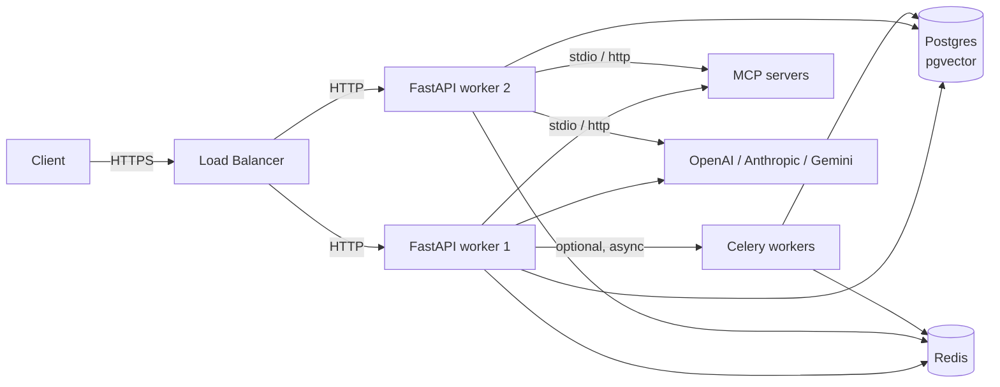
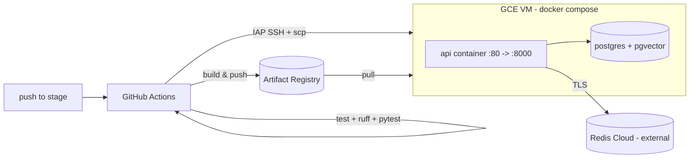

# Deployment

Running this project in environments other than `dev`.

> For the concrete CI/CD pipeline that ships the `stage` branch to a GCE VM, jump to
> [Automated stage deployment (GCE VM + GitHub Actions)](#automated-stage-deployment-gce-vm--github-actions).

## Topology



## Docker Compose (all-in-one dev)

`docker-compose.yml` ships three services plus Postgres and Redis:

| Service | Purpose |
|---|---|
| `postgres` | `pgvector/pgvector:pg16` with `pgvector` extension ready. |
| `redis` | `redis:7-alpine`. |
| `api` | FastAPI via Uvicorn with `--reload`. |
| `celery-worker` | Celery worker consuming the `CELERY_BROKER_URL` queue. |

Launch the full stack:

```bash
docker-compose up --build
```

Start only infra (recommended while developing the API locally):

```bash
docker-compose up -d postgres redis
```

## Production checklist

Before shipping to any non-dev environment:

1. **Secrets**
   - Generate a strong `JWT_SECRET_KEY` (e.g. `openssl rand -hex 64`).
   - Store provider API keys, DB password, and Redis password in your secret manager, not in the image.
2. **`ENVIRONMENT=production`, `DEBUG=false`**
   - Disables noisy MCP development warnings and hides sensitive tracebacks.
3. **CORS**
   - `app/main.py` currently uses `allow_origins=["*"]`. **Replace** with your front-end origins before production.
4. **Rate limiting**
   - `RATE_LIMIT_PER_MINUTE` is per-IP via `slowapi`. Raise or lower depending on traffic.
   - Consider an edge-level WAF / rate limiter upstream too.
5. **Database**
   - Apply migrations before rolling new versions: `alembic upgrade head`.
   - Set up automated backups (PITR or periodic `pg_dump`).
   - Size `DB_POOL_SIZE` / `DB_MAX_OVERFLOW` against your worker count.
6. **LangGraph checkpointer**
   - Runs in the same database. Plan a retention policy (see [`data-model.md`](./data-model.md#langgraph-checkpointer)).
7. **Redis**
   - Use TLS in production (`REDIS_SSL=true`, `rediss://`).
   - Separate DBs for rate limit / Celery broker / Celery result to keep cleanup simple (already defaulted).
8. **Observability**
   - Set `LANGSMITH_API_KEY` for prompt + run tracing.
   - Set `OTEL_EXPORTER_ENDPOINT` to ship traces to your collector (Grafana Tempo, Jaeger, Honeycomb, …).
   - Ship stdout JSON logs to your log aggregator (ELK, Loki, Datadog).
9. **MCP**
   - Stdio MCP servers spawn OS subprocesses inside the API container — make sure `npx` / `python` / etc. are installed in the image.
   - Pin MCP server package versions.
   - Prefer `streamable_http` MCP servers when they're available — no subprocess lifecycle to worry about.
10. **Graceful shutdown**
    - The `lifespan` handler closes Redis, the checkpointer, and MCP subprocesses on exit. Ensure your orchestrator sends SIGTERM (not SIGKILL) and gives the process time to drain.

## Running FastAPI at scale

Two ways to run the app:

### Uvicorn (simple)

```bash
uvicorn app.main:app --host 0.0.0.0 --port 8000 --workers 4
```

### Gunicorn + Uvicorn workers (recommended)

`app/core/config/gunicorn_configs.py` provides a production config. Typical invocation:

```bash
gunicorn app.main:app -c app/core/config/gunicorn_configs.py
```

Tune `WORKERS` (env var) against CPU count. For async-heavy workloads, **1 worker per core** is a reasonable start since most time is spent awaiting I/O.

### Notes on `--reload`

**Don't use `--reload` with stdio MCP servers in production.** Reload kills and respawns workers abruptly, which can strand subprocess trees. The `lifespan` logs a warning if you do this in development.

## Celery workers

Agent runs can be offloaded from the HTTP request cycle. Example task in `workers/agent_tasks.py::execute_agent_graph`:

```python
from workers.agent_tasks import execute_agent_graph
execute_agent_graph.delay(user_message, session_id, user_id)
```

Start workers:

```bash
celery -A workers.celery_app worker --loglevel=info --concurrency=2
```

When to use:

- **Long-running runs** (e.g. many tool calls) where you want a 202 + polling model.
- **Fan-out** — multiple agent runs triggered by one HTTP event.
- **Offline ingestion** — bulk scoring, batch summarisation.

When **not** to use:

- The chat endpoints already stream via SSE — most interactive cases don't need Celery.

## Scaling guidance

- **CPU-bound steps** are rare — token counting / trimming is minor. Most time is waiting on LLM / DB / MCP I/O.
- **Memory pressure** from message history is capped by `AGENT_MAX_CONTEXT_TOKENS` and the memory-summariser node.
- **LangGraph checkpointer** is the bottleneck for very high write concurrency. Shard by DB or use a read-replica pool if you approach it.
- **MCP stdio** doesn't scale horizontally per-process — each FastAPI worker maintains its own client. For shared MCP, prefer `streamable_http`.

## Zero-downtime deploys

- Alembic migrations should be **backwards-compatible** for one release (add column nullable, deploy, backfill, then drop in the next release).
- The orchestrator is cached per-process on a settings signature — restart all workers after changing any recompile-triggering setting (see [`configuration.md`](./configuration.md#recompile-on-change)).
- Use rolling restart so in-flight SSE streams finish on the old pods while new pods serve new traffic.

## Docker image tips

- Multi-stage build: build dependencies once, copy a slim runtime.
- Include Node.js **only** if you need stdio MCP servers like the filesystem MCP.
- Run as non-root (add `USER app` after install step).
- Read-only root filesystem + writable `/tmp` reduces blast radius.
- Include only runtime deps — omit `dev` extras (`pytest`, `ruff`, `mypy`) from production images.

---

# Automated stage deployment (GCE VM + GitHub Actions)

Pushing to the **`stage`** branch runs tests, builds the API image, pushes it to
**Artifact Registry**, and deploys it on a **Compute Engine VM** with `docker
compose` over an **IAP SSH tunnel**. Authentication is keyless via **Workload
Identity Federation (WIF)** — no service-account JSON keys are stored anywhere.

This is a deliberately cheap, single-VM setup: Postgres (pgvector) runs in a
container next to the API on the same VM; Redis stays external (Redis Cloud);
the Celery worker is not deployed (API only).

## Architecture



- **On the VM**: the FastAPI `api` container (image from Artifact Registry) and a
  `postgres` (pgvector) container sharing a `pgdata` volume — see
  [`docker-compose.prod.yml`](../docker-compose.prod.yml).
- **External**: Redis stays on Redis Cloud (configured through the env file).
- **Migrations** run automatically on every container start via
  [`scripts/docker-entrypoint.sh`](../scripts/docker-entrypoint.sh)
  (`alembic upgrade head` → `uvicorn`).

## Pipeline stages

`.github/workflows/deploy-stage.yml`:

1. **test** — `uv sync --extra dev`, `ruff check .`, `pytest tests/unit` (no secrets needed; tests use in-memory SQLite).
2. **deploy** (needs test) — WIF auth → `docker build`/`push` (`:<sha>` and `:stage`) → render `.env` from the `DOTENV_STAGE` secret (+ append `API_IMAGE`) → `scp` the compose file and `.env` to `~/app` on the VM → `docker compose pull && up -d`.

Concurrency is serialized (`group: deploy-stage`) so deploys don't overlap.

## One-time GCP setup

Set your shell variables first:

```bash
export PROJECT_ID="your-project-id"
export REGION="us-central1"
export ZONE="us-central1-a"
export GH_REPO="your-org/autonomous-travel-guide"   # owner/repo exactly
export AR_REPO="travel-guide"
export INSTANCE="travel-guide-stage"
PROJECT_NUMBER="$(gcloud projects describe "$PROJECT_ID" --format='value(projectNumber)')"
```

### 1. Enable APIs

```bash
gcloud services enable \
  compute.googleapis.com iam.googleapis.com iamcredentials.googleapis.com \
  sts.googleapis.com artifactregistry.googleapis.com iap.googleapis.com \
  --project="$PROJECT_ID"
```

### 2. Artifact Registry (Docker)

```bash
gcloud artifacts repositories create "$AR_REPO" \
  --project="$PROJECT_ID" --location="$REGION" --repository-format=docker
```

### 3. The VM (Docker + Compose preinstalled)

```bash
gcloud compute instances create "$INSTANCE" \
  --project="$PROJECT_ID" --zone="$ZONE" \
  --machine-type=e2-small \
  --image-family=debian-12 --image-project=debian-cloud \
  --boot-disk-size=20GB \
  --scopes=cloud-platform \
  --tags=http-server \
  --metadata=startup-script='#!/bin/bash
set -e
apt-get update
apt-get install -y ca-certificates curl gnupg
install -m 0755 -d /etc/apt/keyrings
curl -fsSL https://download.docker.com/linux/debian/gpg | gpg --dearmor -o /etc/apt/keyrings/docker.gpg
chmod a+r /etc/apt/keyrings/docker.gpg
echo "deb [arch=$(dpkg --print-architecture) signed-by=/etc/apt/keyrings/docker.gpg] https://download.docker.com/linux/debian $(. /etc/os-release && echo $VERSION_CODENAME) stable" > /etc/apt/sources.list.d/docker.list
apt-get update
apt-get install -y docker-ce docker-ce-cli containerd.io docker-compose-plugin
usermod -aG docker $(getent passwd 1000 | cut -d: -f1) || true'
```

`--scopes=cloud-platform` lets the VM use its attached service account to pull
from Artifact Registry. Grant that SA read access:

```bash
VM_SA="${PROJECT_NUMBER}-compute@developer.gserviceaccount.com"
gcloud projects add-iam-policy-binding "$PROJECT_ID" \
  --member="serviceAccount:${VM_SA}" --role="roles/artifactregistry.reader"
```

### 4. Firewall (IAP SSH + HTTP)

```bash
gcloud compute firewall-rules create allow-iap-ssh \
  --project="$PROJECT_ID" --direction=INGRESS --action=ALLOW \
  --rules=tcp:22 --source-ranges=35.235.240.0/20

gcloud compute firewall-rules create allow-http \
  --project="$PROJECT_ID" --direction=INGRESS --action=ALLOW \
  --rules=tcp:80 --source-ranges=0.0.0.0/0 --target-tags=http-server
```

### 5. Workload Identity Federation + deployer SA

```bash
# Pool + GitHub OIDC provider (locked to your repo)
gcloud iam workload-identity-pools create github-pool \
  --project="$PROJECT_ID" --location=global --display-name="GitHub Actions"

gcloud iam workload-identity-pools providers create-oidc github-provider \
  --project="$PROJECT_ID" --location=global \
  --workload-identity-pool=github-pool \
  --display-name="GitHub provider" \
  --issuer-uri="https://token.actions.githubusercontent.com" \
  --attribute-mapping="google.subject=assertion.sub,attribute.repository=assertion.repository" \
  --attribute-condition="assertion.repository=='${GH_REPO}'"

# Deployer service account
gcloud iam service-accounts create github-deployer \
  --project="$PROJECT_ID" --display-name="GitHub Actions deployer"
DEPLOY_SA="github-deployer@${PROJECT_ID}.iam.gserviceaccount.com"

# Let the GitHub repo impersonate it via WIF
gcloud iam service-accounts add-iam-policy-binding "$DEPLOY_SA" \
  --project="$PROJECT_ID" --role="roles/iam.workloadIdentityUser" \
  --member="principalSet://iam.googleapis.com/projects/${PROJECT_NUMBER}/locations/global/workloadIdentityPools/github-pool/attribute.repository/${GH_REPO}"

# Roles the deployer needs (push image, manage/SSH the VM)
for role in \
  roles/artifactregistry.writer \
  roles/compute.instanceAdmin.v1 \
  roles/iap.tunnelResourceAccessor \
  roles/iam.serviceAccountUser; do
  gcloud projects add-iam-policy-binding "$PROJECT_ID" \
    --member="serviceAccount:${DEPLOY_SA}" --role="$role"
done

echo "WIF_PROVIDER=projects/${PROJECT_NUMBER}/locations/global/workloadIdentityPools/github-pool/providers/github-provider"
echo "DEPLOY_SA_EMAIL=${DEPLOY_SA}"
```

## GitHub configuration

In **Settings → Secrets and variables → Actions**.

### Variables

| Name | Example | Meaning |
|------|---------|---------|
| `GCP_PROJECT_ID` | `my-project` | GCP project. |
| `GCP_REGION` | `us-central1` | Artifact Registry region. |
| `GCP_ZONE` | `us-central1-a` | VM zone. |
| `AR_REPO` | `travel-guide` | Artifact Registry repo. |
| `IMAGE_NAME` | `api` | Image name within the repo. |
| `GCE_INSTANCE` | `travel-guide-stage` | VM instance name. |

### Secrets

| Name | Value |
|------|-------|
| `WIF_PROVIDER` | `projects/<PROJECT_NUMBER>/locations/global/workloadIdentityPools/github-pool/providers/github-provider` |
| `DEPLOY_SA_EMAIL` | `github-deployer@<PROJECT_ID>.iam.gserviceaccount.com` |
| `DOTENV_STAGE` | The full production `.env` contents (see below). |

### `DOTENV_STAGE` template

Paste the full env as a multi-line secret. **Do not set `DATABASE_URL`** (the
component values + the compose `DATABASE_HOST=postgres` override are used to
reach the Postgres container). `DATABASE_USER/PASSWORD/NAME` are shared by both
the `postgres` container and the API.

```dotenv
APP_NAME="Autonomous Travel Guide"
ENVIRONMENT=staging
DEBUG=false
LOG_LEVEL=INFO
WORKERS=2

# Postgres (runs in a container on the VM)
DATABASE_USER=postgres
DATABASE_PASSWORD=change-me-strong
DATABASE_NAME=autonomous_travel_guide_db
PGVECTOR_ENABLED=true
PGVECTOR_COLLECTION=knowledge_base

# Redis Cloud (external, TLS)
REDIS_HOST=...
REDIS_PORT=...
REDIS_USER_NAME=default
REDIS_PASSWORD=...
REDIS_SSL=true
CELERY_BROKER_URL=rediss://...
CELERY_RESULT_BACKEND=rediss://...

# Auth
JWT_SECRET_KEY=generate-a-long-random-string

# LLM + tools
OPENAI_API_KEY=...
DEFAULT_LLM_PROVIDER=openai
DEFAULT_MODEL_NAME=gpt-4o-mini
EMBEDDING_MODEL=text-embedding-3-small
EMBEDDING_DIMENSIONS=1536
TAVILY_API_KEY=...

# Travel guide
TRAVEL_PLANNER_ENABLED=true
JINA_API_KEY=...
JINA_DEEPSEARCH_MODEL=jina-deepsearch-v1

# Observability (optional)
LANGSMITH_API_KEY=...
LANGSMITH_PROJECT=autonomous_travel_guide
```

> Secrets live in GitHub Actions secrets and are written to `~/app/.env` on the
> VM at deploy time — they are never baked into the image or committed.

## Deploy, verify, roll back

- **Deploy**: push to `stage` (or run the workflow manually via *Actions →
  Deploy (stage) to GCE → Run workflow*).
- **Verify**: the API listens on the VM's external IP on port **80**. Hit the
  health endpoint, e.g. `curl http://<VM_EXTERNAL_IP>/health`.
- **Logs** (on the VM): `cd ~/app && docker compose -f docker-compose.prod.yml logs -f api`.
- **Roll back**: set `API_IMAGE` in `~/app/.env` to a previous `:<sha>` tag and
  run `docker compose -f docker-compose.prod.yml up -d`, or re-run the workflow
  from an older commit.

## Notes & next steps

- For real production, add TLS (a reverse proxy / managed cert) and a domain;
  this stage setup serves plain HTTP on port 80. See the production checklist above.
- Postgres data persists in the `pgdata` Docker volume on the VM. Snapshot the
  disk for backups.
- To add the Celery worker later, add a `celery-worker` service to
  `docker-compose.prod.yml` reusing the same `${API_IMAGE}` with the worker command.
