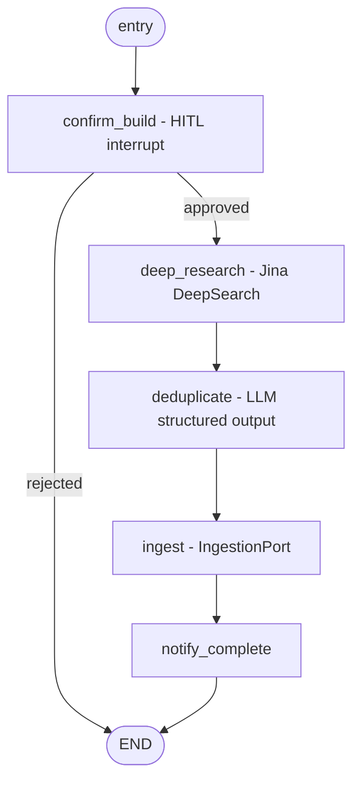

# Knowledge Builder

The **Knowledge Builder** is one of the two travel graphs (the other is the Planner). Its job: when we have no knowledge base for a destination, run autonomous deep research, clean it, and ingest it into the vector store so the Planner's city-expert agent can answer questions about that destination.

It is built **first** so the KB has data before the Planner relies on it.

## Pipeline



| Node | Kind | Responsibility |
|------|------|----------------|
| `confirm_build` | HITL (`interrupt()`) | Warn the user deep research may take a while; wait for approve/reject. Marks `kb_destinations.status = building` on approval. |
| `deep_research` | async I/O | Compose a research brief from `city`/`country`/`topics` and call the Jina DeepSearch client. Stores raw text + sources in state. |
| `deduplicate` | LLM (structured) | Remove redundant/overlapping content and organize the research into topic-tagged segments (`PreparedKnowledge`). |
| `ingest` | async I/O | Send the cleaned segments to the `IngestionService`; store vectors in pgvector. On success marks `status = ready` + `doc_count`; on failure marks `status = failed`. |
| `notify_complete` | sync | Emit an `AIMessage` telling the user the destination KB is ready. |

The graph is **linear with one branch** (approve/reject) — no loops — so the state uses plain fields (no list reducers beyond the inherited `messages`). The one exception: `phase` / `phase_status` carry the `merge_phase` reducer, shared with the planner/root states so parallel specialists can write progress concurrently (see [Travel Planner § progress reporting](./travel-planner.md)).

## State

`app/modules/agent_orchestration/domain/states/knowledge_builder_state.py` — `KnowledgeBuilderState(BaseAgentState)`:

| Field | Type | Notes |
|-------|------|-------|
| `destination_key` | `str` | Canonical key from `build_destination_key()`. |
| `city` / `country` | `str \| None` | Display + metadata. |
| `topics` | `list[str]` | Research topics (defaults injected by the builder). |
| `approved` | `bool \| None` | Set by `confirm_build`. |
| `raw_research` | `str \| None` | Jina output. |
| `research_sources` | `list[str]` | Visited URLs / citations. |
| `prepared_segments` | `list[dict]` | `[{topic, content}]` after dedup. |
| `doc_count` | `int` | Number of vectors stored. |
| `phase` / `phase_status` | `str \| None` | Progress reporting (see below). |

(Plus inherited `messages`, `session_id`, `user_id`, `error`, `human_feedback`.)

## Components and boundaries

Clean-architecture boundaries are preserved: the graph (infrastructure) depends on **ports** (application), and concrete adapters (infrastructure) implement them.

### Deep research (`IDeepResearchClient`)
- Port: `app/modules/agent_orchestration/application/ports/deep_research_port.py`
- Adapter: `app/infrastructure/research/jina_deepsearch_client.py` — calls Jina DeepSearch (OpenAI-compatible `/v1/chat/completions`, `model = JINA_DEEPSEARCH_MODEL`, `reasoning_effort = JINA_DEEPSEARCH_REASONING_EFFORT`, `Authorization: Bearer JINA_API_KEY`).

### Ingestion (`IIngestionService`)
- Port: `app/modules/agent_orchestration/application/ports/ingestion_port.py` — `ingest(segments, destination) -> IngestionResult`.
- Adapters in `app/infrastructure/ingestion/`:
  - `LocalPgVectorIngestionAdapter` (fallback when no URL is set): chunks + embeds segments locally and `add_documents()` into pgvector with metadata `{destination_key, city, country, topic, source}`.
  - `HttpIngestionAdapter`: integrates the external **RAG Document Processor** (see below). It does **not** re-embed — the service returns vectors, which are upserted into pgvector via `PGVector.add_embeddings`.
  - `factory.build_ingestion_service()` picks the adapter based on `INGESTION_SERVICE_URL`.

### KB status (`KBStatusService`)
- `app/modules/agent_orchestration/application/use_cases/kb_status_service.py` wraps the `SqlAlchemyUnitOfWork` to upsert `kb_destinations` rows (`mark_building` / `mark_ready` / `mark_failed` / `get_status`).

## External ingestion service contract (RAG Document Processor)

**Status: live** on Cloud Run. Used when `INGESTION_SERVICE_URL` is set; otherwise the local fallback runs. Auth header `X-API-Key: <INGESTION_SERVICE_API_KEY>` (key issued by the service operator). All routes under `/api/v1`; interactive schema at `{BASE_URL}/docs`.

Each knowledge segment becomes its own job, so per-topic metadata survives. Jobs run concurrently up to `INGESTION_MAX_CONCURRENCY`.

1. `POST /ingest/text` `{ texts, embedding_pipeline: "chunk_then_embed", macro_splitter, embedder_provider, embedding_model, embedding_dimensions }` -> `{ job_id }`.
2. Poll `GET /jobs/{job_id}` every `INGESTION_POLL_INTERVAL_S` until `status` in `{completed, failed}`, bounded by `INGESTION_POLL_TIMEOUT_S`. A `failed` status raises with `error_message`.
3. `GET /jobs/{job_id}/results` -> `{ chunks: [{ index, text, embedding, metadata }] }` (retry on `409 job_results_not_ready`).
4. Upsert `text + embedding + metadata` into pgvector via `PGVector.add_embeddings` without re-embedding, adding `{destination_key, city, country, topic, source}`.

**Consistency rule (enforced):** the adapter pins `embedder_provider`, `embedding_model`, and `embedding_dimensions` on every submit rather than relying on server defaults, and **raises if a returned vector's width differs from `EMBEDDING_DIMENSIONS`**. Storing mismatched vectors would make those documents permanently unsearchable by the city expert. The service's `late_chunking` pipeline always uses Jina, so it is incompatible with our OpenAI query-time embedder — the adapter always requests `chunk_then_embed`.

Errors come back as `{detail, code}` and are surfaced with the code attached (e.g. `401` invalid key, `422 invalid_embedding_dimensions` including the allowed min/max). Valid dimension ranges per model: `GET /api/v1/embeddings/dimension-constraints` (our `text-embedding-3-small` allows 256–1536; we use 1536).

Smoke-test the integration end to end (no pgvector writes):

```bash
uv run python scripts/check_ingestion_service.py
```

## Prompts

- Intent `KNOWLEDGE_DEDUP` (`knowledge_builder/dedup_v1.md.jinja`) — paired with the shared `STRUCTURED_OUTPUT_SYSTEM` system prompt, emits `PreparedKnowledge`.
- Registered in `app/core/config/prompt_registry.toml`.

## Wiring status

Stage 1 built the subgraph and all its dependencies as standalone, testable units. **Stage 3** wires it into the **travel master graph** (`travel_master_builder.py`, state `TravelRootState`) alongside the Travel Planner:

- The Planner's `city_expert` auto-triggers a build on a KB miss; the master routes Planner → `knowledge_builder` → `after_build` → Planner (re-plan). See [Travel Planner § Stage 3](./travel-planner.md#stage-3--kb-miss-auto-trigger-master-graph).
- `confirm_build`'s `interrupt()` is the approval gate. On **reject**, the builder ends without ingesting (nothing written to the KB) and the Planner falls back to web search.
- The master is selected by `MainGraphOrchestrator` when `TRAVEL_PLANNER_ENABLED` is true.

## Progress reporting

This graph is where the long silences happen — deep research alone is bounded by `JINA_DEEPSEARCH_TIMEOUT_S` (300 s by default). Every node therefore emits a `phase_status` announcing the step that is **about to** run, streamed to clients as `{"phase":"knowledge_build","status":"…"}` via `stream_detail=phases` ([API reference](./api-reference.md#post-chatstream)):

| Node | Announces |
|------|-----------|
| `confirm_build` (approved) | "Researching {destination} in depth — this can take a few minutes." |
| `confirm_build` (rejected) | Falls back to `planning`: "Skipping the knowledge build — using web search instead." |
| `deep_research` | "Sorting through the research findings." (or "Deep research failed.") |
| `deduplicate` | "Storing what I learned in the knowledge base." |
| `ingest` | "Knowledge base ready (N entries)." (or the storage failure) |

## Human-in-the-loop

`confirm_build` uses LangGraph `interrupt()`. The run pauses and the API returns `interrupted: true` with an approval request; the client resumes via `POST /api/v1/runs/{thread_id}/resume` with `{ "action": "approve" | "reject" }`. This reuses the existing HITL machinery (`human_review_node` pattern + `Command(resume=...)`).

The interrupt payload is tagged `"kind": "kb_build"` so clients can distinguish it from the planner's `"kind": "requirements"` question and render an approve/reject prompt instead of a text box.
