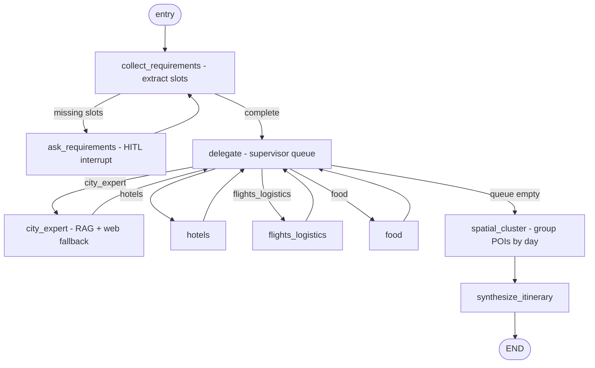
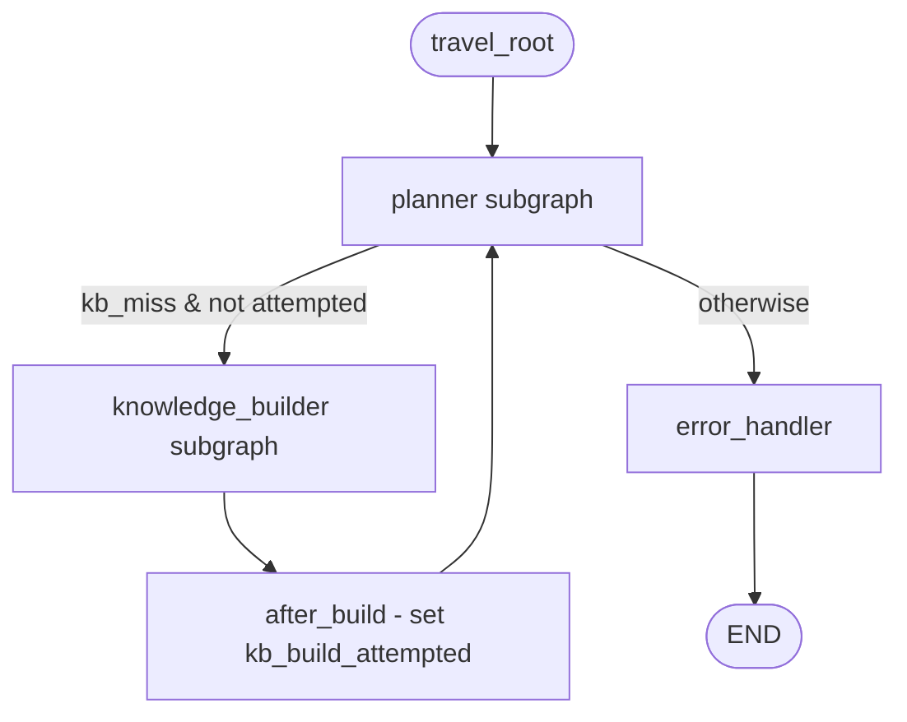

# Travel Planner

The **Travel Planner** is the user-facing travel graph. It collects trip requirements from the user (human-in-the-loop), then orchestrates specialist agents to produce a day-by-day itinerary. The city-expert specialist answers destination questions from the knowledge base (filled by the [Knowledge Builder](./knowledge-builder.md)) with a web-search fallback.

## Pipeline

The **supervisor** is split into two responsibilities that the plan merged into one role:
1. **Requirements gathering** — `collect_requirements` extracts trip slots from the conversation via structured output; if required slots are missing, `ask_requirements` pauses with `interrupt()` to ask the user, then loops back.
2. **Delegation** — once requirements are complete, `delegate` walks a queue of specialists (deterministic, so every section is produced exactly once), routing to each in turn and back, then to `synthesize_itinerary` when the queue is empty.

> Design note: delegation is a deterministic queue rather than per-step LLM routing. A planner needs *all* sections (lodging, travel, food, local knowledge), so a queue is more reliable and cheaper than asking an LLM to micro-route. This is easy to swap for LLM routing later.

## Required vs optional slots

| Slot | Required | Notes |
|------|----------|-------|
| destination (city and/or country) | Yes | At least one of city/country. |
| `num_days` | Yes | Trip length. |
| `budget` | Yes | Free text (e.g. "$1500", "mid-range"). |
| `start_date` | No | — |
| `party_size` | No | — |
| `interests` | No | List of themes (food, history, nightlife...). |

## State

`app/modules/agent_orchestration/domain/states/travel_planner_state.py` — `TravelPlannerState(BaseAgentState)`:

| Field | Type | Notes |
|-------|------|-------|
| `requirements` | `dict` | Latest extracted `TripRequirements`. |
| `requirements_complete` | `bool` | All required slots present. |
| `missing_slots` | `list[str]` | What's still needed. |
| `pending_specialists` | `list[str]` | Delegation queue. |
| `next_specialist` | `str \| None` | Current routing target. |
| `specialist_outputs` | `dict[str, list[dict]]` | Per-specialist **structured** results (validated Pydantic items, JSON-serialised), merged via reducer. |
| `clusters` | `list[dict]` | Deterministic per-day POI groupings (`DayCluster` dumps) from `spatial_cluster`. |
| `itinerary` | `str \| None` | Final plan. |
| `destination_key` | `str` | Canonical KB key set by city_expert on a miss (cross-graph). |
| `city` / `country` | `str \| None` | Destination handed to the Knowledge Builder (cross-graph). |
| `kb_miss` | `bool` | City_expert found no KB data and requests a build. |
| `kb_build_attempted` | `bool` | A build was already attempted this run (set by the master after the builder). |
| `phase` | `str \| None` | Coarse progress phase (see below). |
| `phase_status` | `str \| None` | User-facing progress line streamed by `stream_detail=phases`. |

## Progress reporting

Nodes attach a `phase` + `phase_status` to their state updates; the SSE layer turns changes into `{"phase", "status"}` events (see [API reference](./api-reference.md#post-chatstream)). Phase constants and status-line builders live in `app/modules/agent_orchestration/domain/phases.py` — pure domain, no framework imports.

**A node announces the work that comes next.** LangGraph publishes a node's updates only *after* it returns, so announcing what a node just did would report every step too late. The cheap nodes therefore carry the announcements standing in front of the slow ones:

| Node | Phase | Announces |
|------|-------|-----------|
| `travel_root` (master) | `requirements` | Run started. |
| `collect_requirements` | `requirements` / `planning` | Which slots are still missing, or that specialists are starting. |
| `ask_requirements` | `requirements` | Answer received, re-checking details. |
| `delegate` | `planning` / `itinerary` | The specialist about to run, or the itinerary write-up. |
| `city_expert` (KB miss) | `knowledge_build` | A knowledge build is about to be proposed. |
| `synthesize_itinerary` | `done` | Itinerary finished. |

Because progress originates *inside* the planner subgraph, the orchestrator streams with `subgraphs=True`. Each `AgentEvent` carries a `namespace` (enclosing subgraph nodes, empty at master level) so `content` / `full` modes can keep emitting master-level events only and avoid duplicating a reply that appears both nested and aggregated.

## Specialists

- **city_expert** — builds a destination-scoped pgvector retriever (`build_destination_retriever(destination_key)`), queries the KB, and falls back to `web_search` when the KB returns nothing. (KB-miss auto-trigger of the Knowledge Builder is wired in **Stage 3**.)
- **hotels** / **flights_logistics** / **food** — search-then-structure specialists driven by a shared parameterized prompt. `flights_logistics` also covers local transport / day-routing and uses `LOGISTICIAN_MODEL` when set.

All specialists produce **structured output** (Stage 6): a validated Pydantic list rather than prose, stored in `specialist_outputs[role]` as `model_dump()["items"]`. Schemas live in `app/modules/agent_orchestration/domain/schemas/travel_plan.py`:

| Specialist | Schema | Item fields |
|-----------|--------|-------------|
| `city_expert` | `POIList` | `name`, `category`, `lat?`, `lng?`, `estimated_duration_min?`, `notes` |
| `hotels` | `HotelOptionList` | `name`, `area`, `nightly_rate_usd?`, `lat?`, `lng?`, `notes` |
| `flights_logistics` | `FlightOptionList` | `summary`, `price_usd?`, `details` |
| `food` | `POIList` (category = restaurant/food) | same as `city_expert` |

Coordinates are **LLM best-estimates** (Stage 6 decision): approximate lat/lng from the model's knowledge, `null` when unknown — no geocoding network dependency. That's accurate enough for the day-clustering heuristic (Stage 7) and keeps tests offline. The schemas accept common LLM wrapper variants (`pois`/`places`/`attractions`, `hotels`/`options`, `flights`/`routes`) and ignore extra fields, so real-model output validates robustly.

The itinerary node renders these lists as compact bullets (name + `[category, (lat, lng), ~$price, ~N min] — note`) for the `travel_itinerary` prompt.

## Spatial day clustering (Stage 7)

After all specialists run, `delegate` routes to the deterministic **`spatial_cluster`** node (no LLM) before synthesis. It groups the geo-located POIs into `num_days` coherent days so the itinerary doesn't zig-zag across the city.

- **Inputs:** POIs from `city_expert` + `food` (deduped by name — the same place can surface in both), and an **anchor** = the first hotel option that has coordinates (falls back to the POI centroid when no hotel is located).
- **Algorithm** (`domain/clustering.py`, pure + offline): farthest-first assignment of POIs to the nearest day's centroid (so outliers spread across days), then a nearest-neighbour ordering of each day's stops starting from the anchor. Coordinate-less POIs are distributed round-robin so nothing is dropped.
- **Travel hops** (`domain/geo.py`): each consecutive pair gets a straight-line `haversine_km` distance and a heuristic `travel_minutes` (walk ≤ 1.5 km at 4.5 km/h, else transit at 22 km/h + 12 min overhead, rounded to 5-minute steps). Approximate by design — the coordinates are LLM estimates.
- **Output:** `clusters: list[DayCluster]` (`{day, anchor_name, stops[], legs[]}`). The itinerary prompt receives this as a "Suggested day grouping" backbone and may reorder within a day or move a stop if it improves flow.

Because it's deterministic, the same specialist outputs always yield the same grouping — which is what makes it unit-testable without an LLM.

## Prompts

Registered in `app/core/config/prompt_registry.toml`:

| Intent | Asset | Purpose |
|--------|-------|---------|
| `travel_requirements` | `travel_planner/requirements_v1.md.jinja` | Structured extraction of `TripRequirements`. |
| `travel_specialist` | `travel_planner/specialist_v1.md.jinja` | Shared hotels/flights/food prompt (parameterized by `role`). |
| `travel_city_expert` | `travel_planner/city_expert_v1.md.jinja` | Answer destination questions from KB evidence + web fallback. |
| `travel_itinerary` | `travel_planner/itinerary_v1.md.jinja` | Compose the final day-by-day plan. |

## Dependencies (injected into `build_travel_planner_graph`)

- `llm` (+ optional `requirements_llm`, `logistician_llm`).
- `prompt_provider`.
- `web_search_tool` — the existing Tavily `web_search` tool (optional; specialists degrade gracefully without it).
- `retriever_provider: Callable[[str | None], BaseRetriever | None]` — returns a destination-scoped retriever for the city expert (or `None` when pgvector is unavailable).

This keeps the graph testable with fakes and free of hard DB/network coupling.

## Stage 3 — KB-miss auto-trigger (master graph)

Stage 3 wires the planner and the [Knowledge Builder](./knowledge-builder.md) into a single **travel master graph** (`travel_master_builder.py`, state `TravelRootState` — a superset of both subgraph states). The master is compiled by `MainGraphOrchestrator` whenever `TRAVEL_PLANNER_ENABLED` is true (otherwise the original supervisor graph is used).

**Flow when the KB has no data for a destination:**

1. `city_expert` builds the destination retriever and finds it empty. Because the KB is operational (`retriever_provider` returned a retriever) and no build has been attempted, it sets `kb_miss=True` + `destination_key`/`city`/`country`, posts a short "I'll run a deep search, approval coming next" message, and the planner ends early (`route_after_city_expert → END`).
2. The master routes to the **Knowledge Builder** (`route_after_planner`). Its `confirm_build` node `interrupt()`s for the user's **approval**.
   - **Approved** → deep research → dedup → ingest into pgvector → `notify_complete`. The KB is now populated.
   - **Rejected** → the builder ends without writing anything to the KB.
3. `after_build` sets `kb_build_attempted=True` and the master **re-plans** (back to `planner`).
4. On the second pass `city_expert` does not re-trigger (build already attempted). If the KB is now populated it answers from RAG; if the build was rejected/failed it uses the **web-search fallback** — and nothing is stored in the KB. The planner then runs the remaining specialists and synthesizes the itinerary.

This satisfies the requirement: *announce the search and ask for approval; on rejection use web search but do not store the results in the KB.*

> The retriever-operational guard matters: when pgvector is unavailable (`retriever_provider` returns `None`) the city expert skips the KB build entirely and goes straight to web search, since there would be nowhere to serve the indexed data from.

## Tests

- `tests/unit/test_travel_master.py` — router logic + master-graph compilation.
- `tests/unit/test_travel_master_e2e.py` — drives the **compiled** master graph with an in-memory checkpointer and fakes through both full cycles: KB miss → **approve** → ingest → re-plan → itinerary, and KB miss → **reject** → web fallback with nothing stored. This exercises the real `interrupt()`/resume and cross-graph routing without DB/LLM/network. A third test asserts the streamed phase order across both subgraphs.
- `tests/unit/test_phase_streaming.py` — phase status builders, event mapping, and SSE payload shaping.
